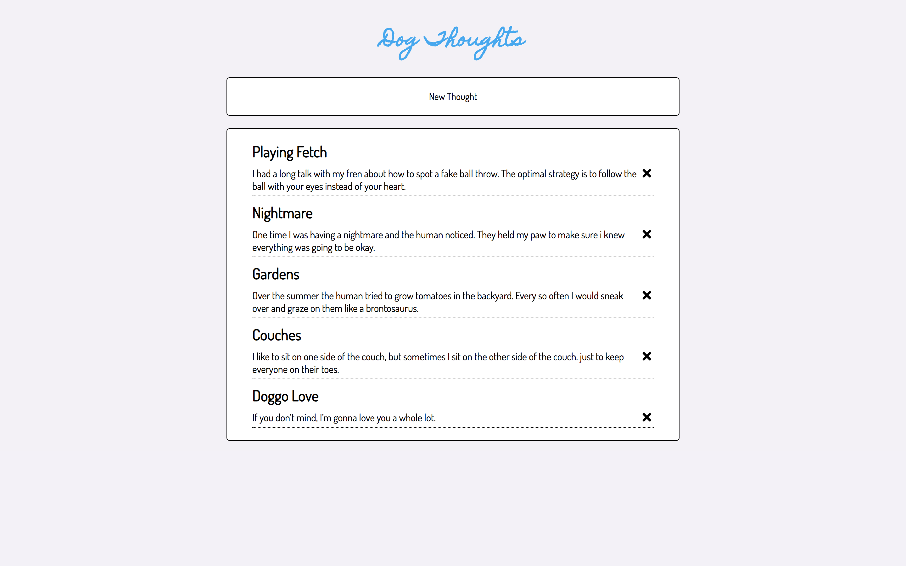
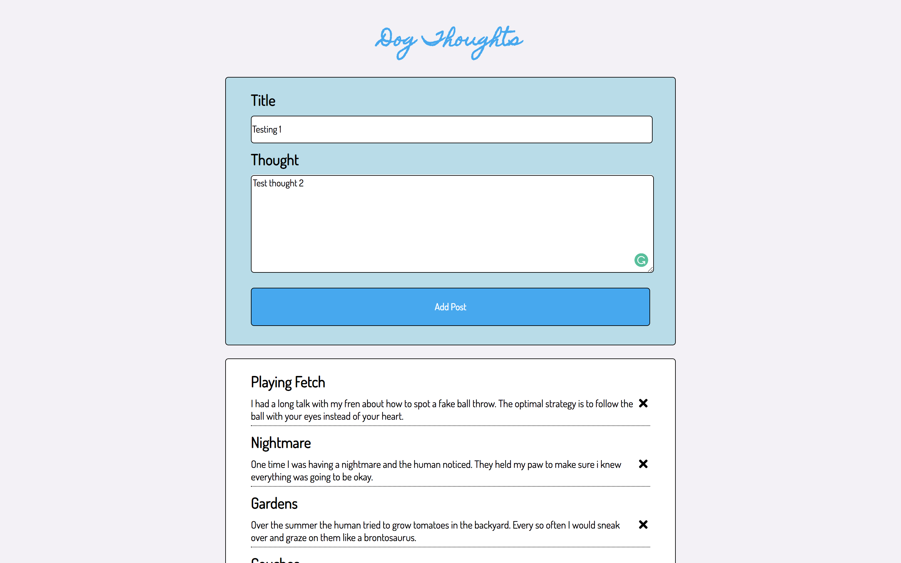

# mock-twitter-feed-angular
Use components to construct a list of small posts, similar to Twitter.

Task: Use components to construct a list of small posts, similar to Twitter.

What does the application do?

1. Displays a list of posts including a subject line and a body for each.
2. The new post form is initially hidden. Clicking the “New Post” button reveals the form.
3. Submitting the form adds a new post to the top of the list and hides the form.
4. Form inputs expand when focused.
Build Specifications:
1. Almost all of the code is in three components. There are no stand-alone controllers.
a. The socialPosts component is the parent component.
i. It owns the list of posts.
ii. Its template contains the ng-repeat for posts and the “New Post” button.
iii. The other two components are created inside of its template.
b. The post component displays a single post in the list.
i. It has one inbound binding called post.
c. The postForm component displays the new post form.
i. It has one outbound binding called onSubmit.
2. Create an expandOnFocus directive that increases the size when the item is focused.
The size returns to normal on blur. Apply this directive to both form inputs.

Bonus:
1. Use the ng-animate library to put a slide in/out animation effect on the new post form
showing and hiding.

